<div align="center">



# KiCAD MCP Server

[🇺🇸 **English** (EN)](#english) &nbsp;•&nbsp; [🇩🇪 **Deutsch** (DE)](#deutsch)

[](../LICENSE)
[](../docs/PLATFORM_GUIDE.md)
[](https://www.kicad.org/)
[](https://github.com/mixelpixx/KiCAD-MCP-Server/stargazers)
[](https://github.com/mixelpixx/KiCAD-MCP-Server/discussions)

</div>

---

## English

**KiCAD MCP Server** is a Model Context Protocol (MCP) server that enables AI assistants like Claude to interact with KiCAD for PCB design automation. Built on the MCP 2025-06-18 specification, this server provides comprehensive tool schemas and real-time project state access for intelligent PCB design workflows.

### Design PCBs with natural language

Describe what you want to build — and let AI handle the EDA work. Place components, create custom symbols and footprints, route connections, run checks, and export production files, all by talking to your AI assistant.

### What it can do today

- Project setup, schematic editing, component placement, routing, DRC/ERC, export
- **Custom symbol and footprint generation** — for modules not in the standard KiCAD library
- **Personal library management** — create once, reuse across projects
- **JLCPCB integration** — parts catalog with pricing and stock data
- **Freerouting integration** — automatic PCB routing via Java/Docker
- **Visual feedback** — snapshots and session logs for traceability
- **Cross-platform** — Windows, Linux, macOS

### Quick Start

1. Install [KiCAD 9.0+](https://www.kicad.org/download/)
2. Install [Node.js 18+](https://nodejs.org/) and [Python 3.11+](https://www.python.org/)
3. Clone and build:

```bash
git clone https://github.com/mixelpixx/KiCAD-MCP-Server.git
cd KiCAD-MCP-Server
npm install
npm run build
```

4. Configure Claude Desktop — see [Platform Guide](../docs/PLATFORM_GUIDE.md)

### Documentation

- [Quick Start (Router Tools)](../docs/ROUTER_QUICK_START.md) — first steps
- [Tool Inventory](../docs/TOOL_INVENTORY.md) — all available tools
- [Schematic Tools Reference](../docs/SCHEMATIC_TOOLS_REFERENCE.md)
- [Routing Tools Reference](../docs/ROUTING_TOOLS_REFERENCE.md)
- [Footprint & Symbol Creator Guide](../docs/FOOTPRINT_SYMBOL_CREATOR_GUIDE.md)
- [JLCPCB Usage Guide](../docs/JLCPCB_USAGE_GUIDE.md)
- [Platform Guide](../docs/PLATFORM_GUIDE.md)
- [Changelog](../CHANGELOG.md)

### Community

- [Discussions](https://github.com/mixelpixx/KiCAD-MCP-Server/discussions) — questions, ideas, showcase
- [Issues](https://github.com/mixelpixx/KiCAD-MCP-Server/issues) — bugs and feature requests
- [Contributing](../CONTRIBUTING.md)

### AI Disclosure

> **Developed with AI Assistance**  
> This project was developed with the support of AI-assisted coding tools (GitHub Copilot, Claude).  
> All code has been reviewed, tested, and integrated by the maintainers.  
> AI tools were used to accelerate development — creative decisions, architecture, and responsibility remain entirely with the authors.

---

## Deutsch

**KiCAD MCP Server** ist ein Model Context Protocol (MCP) Server, der KI-Assistenten wie Claude ermöglicht, mit KiCAD für die PCB-Design-Automatisierung zu interagieren. Aufgebaut auf der MCP-Spezifikation 2025-06-18, bietet dieser Server umfassende Tool-Schemas und Echtzeit-Projektzugriff für intelligente PCB-Design-Workflows.

### PCBs mit natürlicher Sprache designen

Beschreibe was du bauen möchtest — und lass die KI die EDA-Arbeit übernehmen. Bauteile platzieren, eigene Symbole und Footprints erstellen, Verbindungen routen, Prüfungen ausführen und Fertigungsdateien exportieren — alles im Gespräch mit deinem KI-Assistenten.

### Was es heute kann

- Projektanlage, Schaltplan-Bearbeitung, Bauteil-Platzierung, Routing, DRC/ERC, Export
- **Eigene Symbole und Footprints generieren** — auch für Module die in KiCAD-Standardbibliotheken fehlen
- **Eigene Bibliotheksverwaltung** — einmal erstellt, in jedem Projekt wiederverwendbar
- **JLCPCB-Integration** — Bauteilkatalog mit Preisen und Lagerbestand
- **Freerouting-Integration** — automatisches PCB-Routing via Java/Docker
- **Visuelles Feedback** — Snapshots und Session-Logs für Nachvollziehbarkeit
- **Plattformübergreifend** — Windows, Linux, macOS

### Schnellstart

1. [KiCAD 9.0+](https://www.kicad.org/download/) installieren
2. [Node.js 18+](https://nodejs.org/) und [Python 3.11+](https://www.python.org/) installieren
3. Klonen und bauen:

```bash
git clone https://github.com/mixelpixx/KiCAD-MCP-Server.git
cd KiCAD-MCP-Server
npm install
npm run build
```

4. Claude Desktop konfigurieren — siehe [Plattform-Anleitung](../docs/PLATFORM_GUIDE.md)

### Dokumentation

- [Schnellstart (Router Tools)](../docs/ROUTER_QUICK_START.md) — erste Schritte
- [Werkzeug-Übersicht](../docs/TOOL_INVENTORY.md) — alle verfügbaren Werkzeuge
- [Schaltplan-Werkzeuge](../docs/SCHEMATIC_TOOLS_REFERENCE.md)
- [Routing-Werkzeuge](../docs/ROUTING_TOOLS_REFERENCE.md)
- [Footprint & Symbol erstellen](../docs/FOOTPRINT_SYMBOL_CREATOR_GUIDE.md)
- [JLCPCB-Anleitung](../docs/JLCPCB_USAGE_GUIDE.md)
- [Plattform-Anleitung](../docs/PLATFORM_GUIDE.md)
- [Changelog](../CHANGELOG.md)

### Community

- [Diskussionen](https://github.com/mixelpixx/KiCAD-MCP-Server/discussions) — Fragen, Ideen, Projekte zeigen
- [Issues](https://github.com/mixelpixx/KiCAD-MCP-Server/issues) — Fehler und Feature-Wünsche
- [Mitwirken](../CONTRIBUTING.md)

### KI-Hinweis

> **Entwickelt mit KI-Unterstützung**  
> Dieses Projekt wurde unter Einsatz von KI-gestützten Entwicklungswerkzeugen (GitHub Copilot, Claude) erstellt.  
> Sämtlicher Code wurde von den Maintainern geprüft, getestet und integriert.  
> KI-Werkzeuge dienten der Entwicklungsbeschleunigung — kreative Entscheidungen, Architektur und Verantwortung liegen ausschließlich bei den Autoren.
